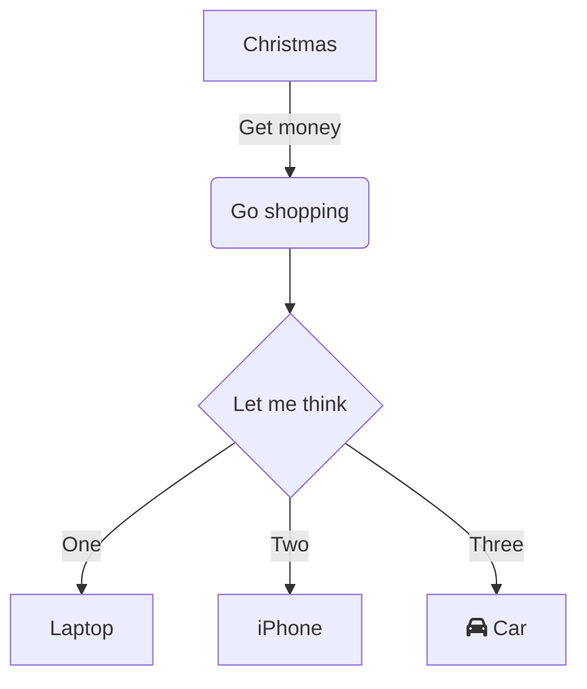
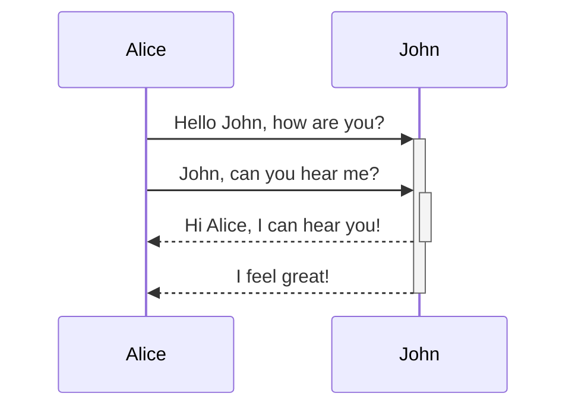
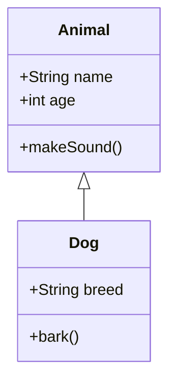
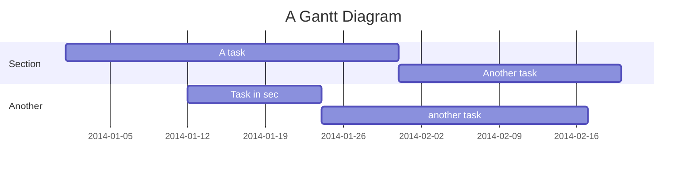

## 前言

Aero Paper v0.5.0 版本带来了许多令人兴奋的新功能和改进。这个版本专注于提升代码展示体验和图表可视化能力，为技术博客作者提供了更强大的工具来展示他们的内容。

## 一、全新的代码块组件

在之前的版本中，原生的代码块组件会产生代码块过长占据大量屏幕空间等问题，影响阅读体验。为了解决这个问题，我们在 v0.5.0 中引入了全新的代码块组件[Expressive Code](https://expressive-code.com/)，具有以下特性：

### 1. 代码块折叠功能

用户可以选择性地添加代码块折叠区域，这样会使得代码的折叠更受掌控，在不影响阅读效果的情况下，提升阅读体验。

通过使用 `collapse` 参数来定义折叠范围。

例如：

````javascript
```javascript collapse={5-9, 29-55}
// 你的代码
// ...
````

效果：

```javascript collapse={5-9, 29-55}
// 监听滚动事件，高亮当前区域
function updateActiveHeading() {
  if (!tocList) return;

  const windowHeight = window.innerHeight;
  const activationPoint = windowHeight / 3 + 4; // 窗口高度的1/3处
  const documentHeight = document.documentElement.scrollHeight;
  const scrollTop = window.scrollY;
  let activeId = "";

  // 检查是否接近页面底部（最后100px）
  const isNearBottom = scrollTop + windowHeight >= documentHeight - 100;

  // 找到当前在激活点的标题
  for (let i = 0; i < tocItems.length; i++) {
    const item = tocItems[i];
    const element = item.element;
    const rect = element.getBoundingClientRect();

    // 检查标题是否已经通过了激活点
    if (rect.top <= activationPoint) {
      activeId = item.id;
    } else {
      // 如果当前标题还没到激活点，停止检查
      break;
    }
  }

  // 如果接近底部且没有激活任何标题，激活最后一个可见的标题
  if (isNearBottom && !activeId && tocItems.length > 0) {
    // 从后往前找第一个在视窗内的标题
    for (let i = tocItems.length - 1; i >= 0; i--) {
      const item = tocItems[i];
      const element = item.element;
      const rect = element.getBoundingClientRect();

      if (rect.top < windowHeight) {
        activeId = item.id;
        break;
      }
    }
  }

  // 更新桌面端激活状态
  updateTocActiveState(tocList, "toc-active-indicator", activeId);

  // 更新移动端激活状态
  if (mobileTocList) {
    updateTocActiveState(
      mobileTocList,
      "mobile-toc-active-indicator",
      activeId
    );
  }
}
```

### 2. 行号支持

新版的 Aero Paper 中使用了 Expressive Code 提供的行号插件，这样可以自动在代码块中渲染出行号，提高了阅读体验。

```python
#!/usr/bin/python
# -*- coding: UTF-8 -*-

i = int(raw_input('净利润:'))
arr = [1000000,600000,400000,200000,100000,0]
rat = [0.01,0.015,0.03,0.05,0.075,0.1]
r = 0
for idx in range(0,6):
    if i>arr[idx]:
        r+=(i-arr[idx])*rat[idx]
        print (i-arr[idx])*rat[idx]
        i=arr[idx]
print r
```

同时，你也可以通过 `showLineNumbers=false` 参数设置来禁用行号展示。

### 3. 代码高亮和主题支持

代码块支持多种编程语言的语法高亮，并且会根据网站的主题（浅色/深色模式）自动切换相应的配色方案，确保在任何环境下都有良好的可读性。

如果想了解更多的配色方案，请参考 [Expressive Code - Syntax Highlighting](https://expressive-code.com/key-features/syntax-highlighting/) 和 [Expressive Code - Themes](https://expressive-code.com/guides/themes/) 。

### 4. 更多的特性

1. 编辑器和终端框架
2. 文本和代码行标记
3. 单词包裹
4. ...

请参考 [Expressive Code 官方文档](https://expressive-code.com/installation/) 。

## 二、Mermaid Diagrams 支持

现在我们可以在博客中使用 Mermaid 图表了！通过集成`rehype-mermaid`插件，这个博客现在支持多种 Mermaid 图表类型：

### 流程图示例



### 时序图示例



### 类图示例



### 甘特图示例



## 三、Github Card 语法支持

现在，你可以在你的文档中使用 Markdown 拓展语法 `::github{repo="owner/repo"}` 来直接插入 Github Card，这个功能可以十分优雅地引用其他的仓库地址。例如：

```markdown showLineNumbers=false
::github{repo="hazuki-keatsu/aero-paper"}
```

::github{repo="hazuki-keatsu/aero-paper"}

## 四、若干问题的修复

1. 由于`article`的宽度变化引起的浮动目录定位错误
2. 修复`ShareLink`在小屏幕下的组件重叠问题
3. 优化目录滚动显示逻辑并添加防抖处理
4. 增加`github-repo-card`组件的响应式样式

## 总结

Aero Paper v0.5.0 版本是一次重要的更新，引入了多项新功能和改进，显著提升了技术博客的展示效果和用户体验。通过全新的代码块组件，我们可以更好地呈现代码内容，支持折叠、行号、语法高亮等功能，使长代码段不再成为阅读障碍。Mermaid 图表支持让我们能够以可视化的方式表达复杂的概念和流程，极大地丰富了内容的表现形式。同时，GitHub Card 语法的加入使得引用开源项目变得更加直观和美观。

> [!TIP]
> 接下来，这个博客主题可能不会再有较大的更新。当然，如果您有更多更好的点子，十分欢迎您给我的仓库提出 Issue。