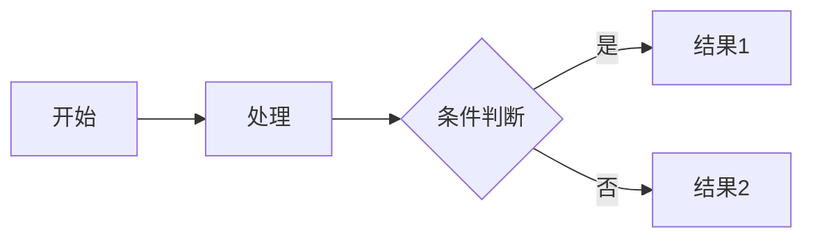
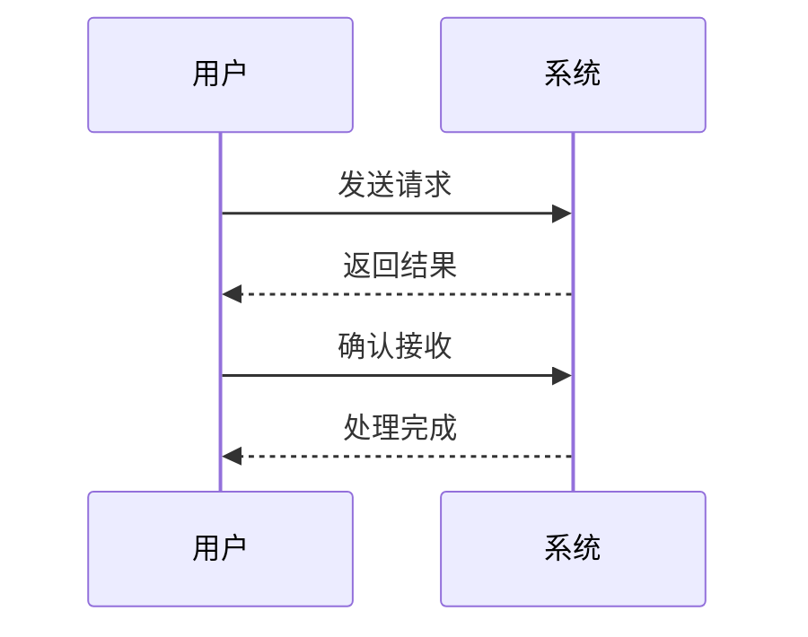
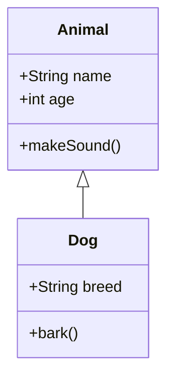

## 前言

## 一、全新的代码块组件

## 二、Mermaid Diagrams 支持

现在我们可以在博客中使用Mermaid图表了！下面是一个简单的流程图示例：

```mermaid
flowchart LR
  A[开始] --> B[处理]
  B --> C{条件判断}
  C -->|是| D[结果1]
  C -->|否| E[结果2]
```

再来一个时序图的例子：

```mermaid
sequenceDiagram
    participant A as 用户
    participant B as 系统
    A->>B: 发送请求
    B-->>A: 返回结果
    A->>B: 确认接收
    B-->>A: 处理完成
```

## Mermaid支持的图表类型

这个博客现在支持多种Mermaid图表类型：

### 类图示例

```mermaid
classDiagram
    class Animal {
        +String name
        +int age
        +makeSound()
    }
    class Dog {
        +String breed
        +bark()
    }
    Animal <|-- Dog
```

这样我们就成功为AeroPaper博客添加了Mermaid图表支持！